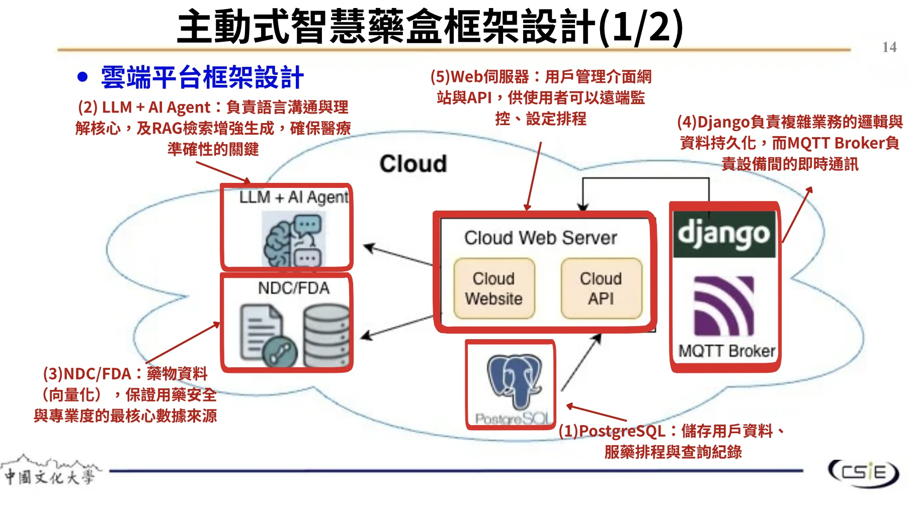
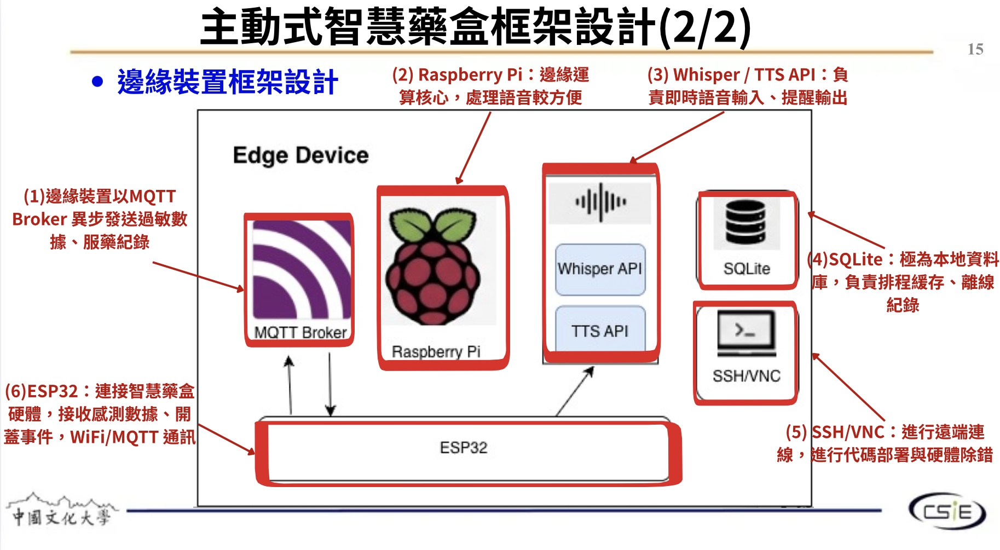
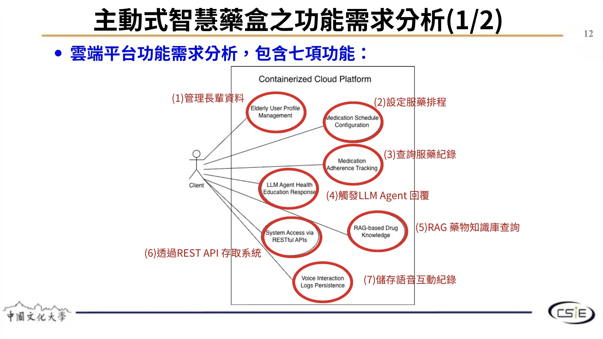
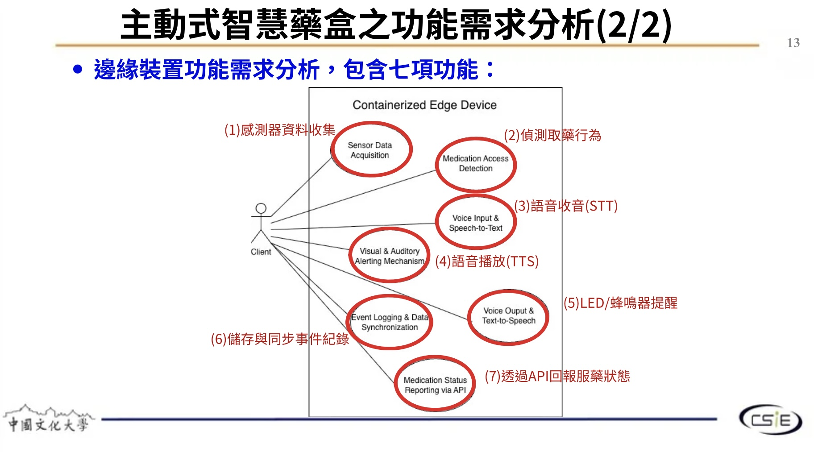

# 主動式智慧藥盒 Smart Pill Box

> 🚧 專案開發中

結合邊緣運算與雲端平台的智慧藥盒系統，以 Raspberry Pi + ESP32 為硬體核心，整合 LLM AI Agent、語音互動與 RAG 藥物知識庫，協助長者安全、準時用藥。

-----

## 系統架構概覽

本系統分為**雲端平台**與**邊緣裝置**兩大部分：

### 雲端平台

|元件                  |說明                          |
|--------------------|----------------------------|
|LLM + AI Agent      |負責語言溝通與理解，結合 RAG 增強生成確保醫療準確性|
|NDC / FDA 藥物資料庫     |向量化藥物資料，作為 RAG 知識來源         |
|Django + MQTT Broker|處理業務邏輯、資料持久化與設備間即時通訊        |
|Cloud Web Server    |提供用戶管理介面與 REST API          |
|PostgreSQL          |儲存用戶資料、服藥排程與查詢紀錄            |

### 邊緣裝置

|元件               |說明                                     |
|-----------------|---------------------------------------|
|ESP32            |連接智慧藥盒硬體，收集感測器數據、偵測開蓋事件，透過 WiFi/MQTT 通訊|
|Raspberry Pi     |邊緣運算核心，處理語音辨識較為方便                      |
|Whisper / TTS API|負責即時語音輸入（STT）與提醒輸出（TTS）                |
|SQLite           |本地資料庫，負責排程緩存與離線紀錄                      |
|SSH / VNC        |遠端連線，進行代碼部署與硬體除錯                       |

-----

## 功能需求分析

### 雲端平台功能（7 項）

1. 管理長輩資料（Elderly User Profile Management）
1. 設定服藥排程（Medication Schedule Configuration）
1. 查詢服藥紀錄（Medication Adherence Tracking）
1. 觸發 LLM Agent 回覆（LLM Agent Health Education Response）
1. RAG 藥物知識庫查詢（RAG-based Drug Knowledge）
1. 透過 REST API 存取系統（System Access via RESTful APIs）
1. 儲存語音互動紀錄（Voice Interaction Logs Persistence）

### 邊緣裝置功能（7 項）

1. 感測器資料收集（Sensor Data Acquisition）
1. 偵測取藥行為（Medication Access Detection）
1. 語音收音（Voice Input & Speech-to-Text）
1. 語音播放（Visual & Auditory Alerting Mechanism / TTS）
1. LED / 蜂鳴器提醒（Voice Output & Text-to-Speech）
1. 儲存與同步事件紀錄（Event Logging & Data Synchronization）
1. 透過 API 回報服藥狀態（Medication Status Reporting via API）

-----

## 技術棧

**硬體**

- Raspberry Pi
- ESP32

**後端 / 雲端**

- Django、PostgreSQL
- MQTT Broker
- REST API

**AI / NLP**

- LLM + AI Agent
- RAG（Retrieval-Augmented Generation）
- Whisper（STT）、TTS API

**資料來源**

- NDC / FDA 藥物資料庫

-----

## 開發進度

- [ ] 硬體電路設計
- [ ] ESP32 韌體開發
- [ ] Raspberry Pi 語音模組
- [ ] Django 後端 API
- [ ] LLM Agent 整合
- [ ] RAG 知識庫建置
- [ ] 前端用戶介面
- [ ] 系統整合測試

